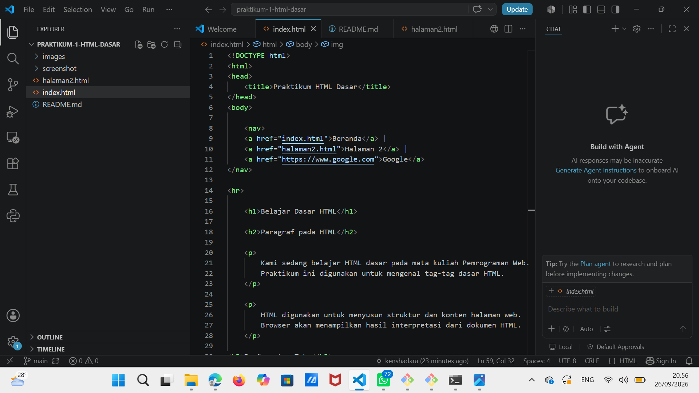
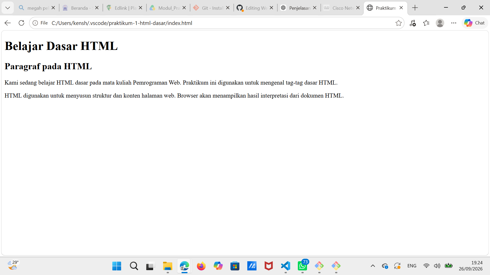
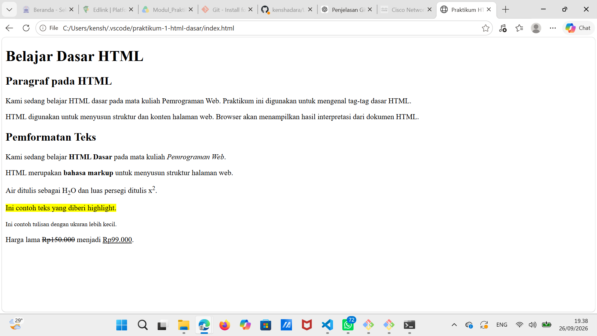
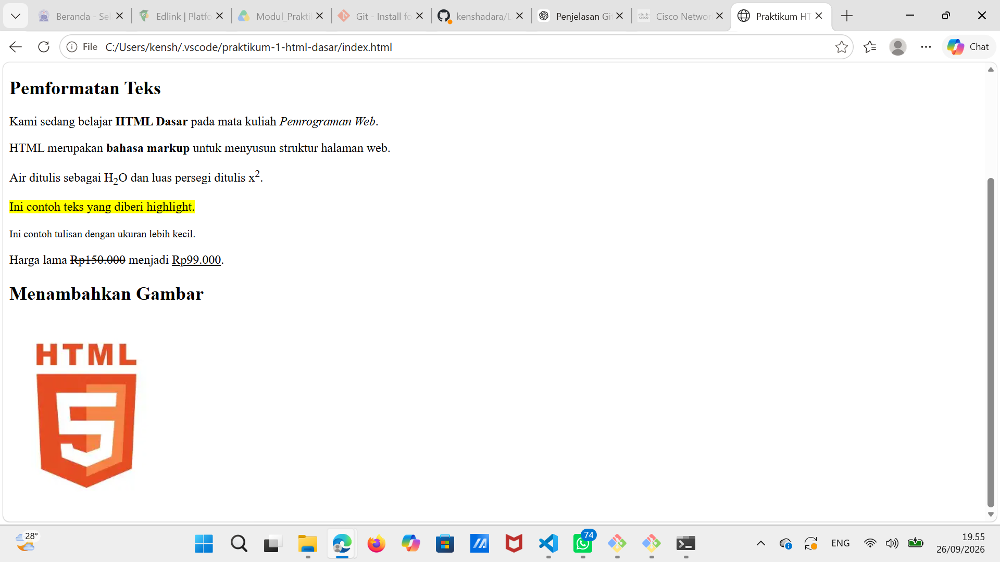
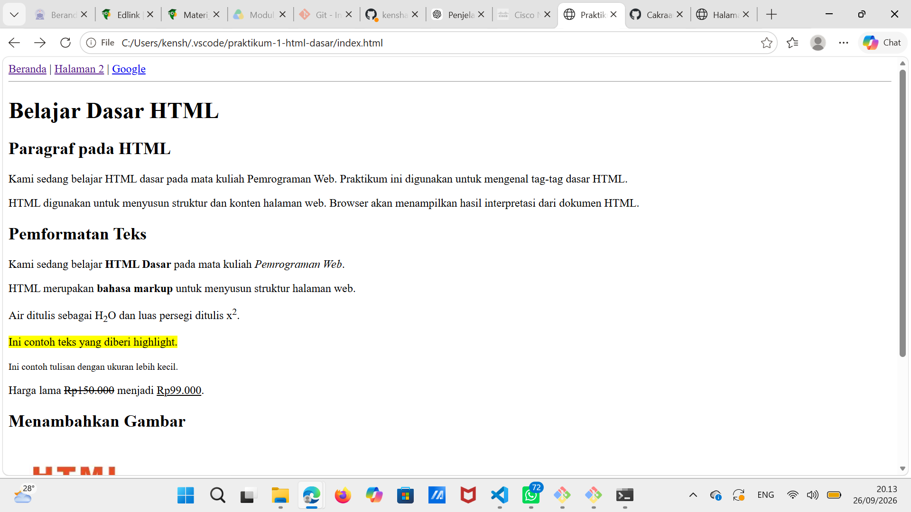
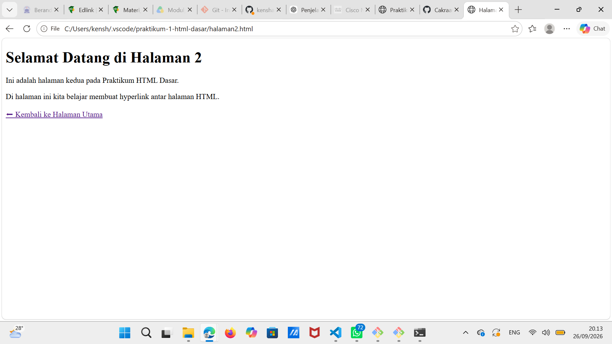
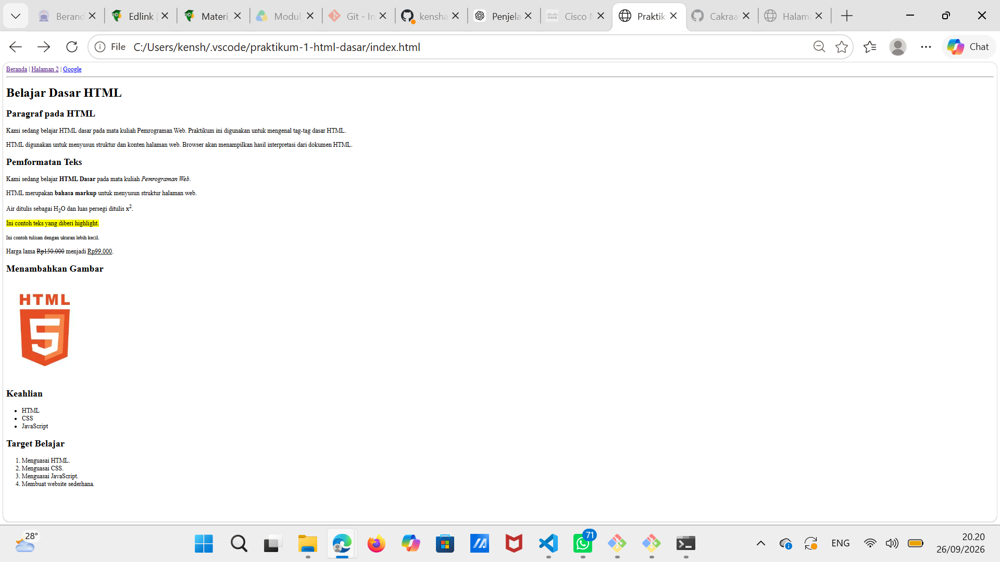

# Praktikum 1 - HTML Dasar

**Nama:** Kensha Dara Riafinola

**NIM:** 312510461

**Program Studi:** Teknik Informatika

**Universitas:** Universitas Pelita Bangsa

## Tujuan Praktikum

Mempelajari dasar-dasar HTML, struktur dokumen HTML, penggunaan heading, paragraf, pemformatan teks, gambar, hyperlink, list, dan komentar HTML.

## Hasil Praktikum

### 1. Struktur Dasar HTML

Membuat file `index.html` menggunakan struktur HTML5.

### 2. Heading dan Paragraf

Membuat judul menggunakan tag `<h1>` dan `<h2>`, serta paragraf menggunakan tag `
`.

### 3. Pemformatan Teks

Mencoba penggunaan tag `<b>`, `<i>`, `<strong>`, ``, ``, `<mark>`, `<small>`, `<del>`, dan `<ins>`.

### 4. Menambahkan Gambar

Menampilkan gambar menggunakan tag `` dengan atribut `src`, `width`, `alt`, dan `title`.

### 5. Hyperlink

Membuat halaman kedua (`halaman2.html`) dan menghubungkannya dengan halaman utama menggunakan tag `<a>`.

### 6. List HTML

Membuat daftar menggunakan unordered list (`<ul>`) dan ordered list (`<ol>`).

### 7. Komentar HTML

Menambahkan komentar menggunakan `<!-- -->` sebagai penanda bagian kode.

## Kesimpulan

Pada praktikum ini saya berhasil membuat halaman web sederhana menggunakan HTML. Saya memahami struktur dasar HTML, penggunaan berbagai tag, atribut gambar, hyperlink, list, dan komentar HTML sebagai dasar pembuatan halaman web.
